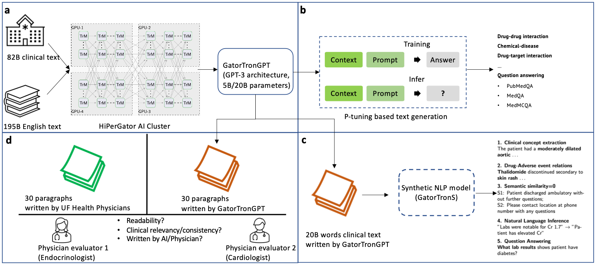

# GatorTronGPT

## Project Overview



## GatorTronGPT

- All the code for training, evaluating and generate medical text with GPT models based on Megatron-LM/Nemo 
- All the code for convert checkpoints to Huggingface and finetuning with HF TRL (instruction finetuning and DPO alignment)

## GatorTronS model from Hugging Face 

- The GatorTronS model is available from : https://huggingface.co/UFNLP/gatortronS
- How to use
```python
from transformers import AutoModel, AutoTokenizer, AutoConfig

tokinizer= AutoTokenizer.from_pretrained('UFNLP/gatortronS')
config=AutoConfig.from_pretrained('UFNLP/gatortronS')
mymodel=AutoModel.from_pretrained('UFNLP/gatortronS')

encoded_input=tokinizer("Bone scan:  Negative for distant metastasis.", return_tensors="pt")
encoded_output = mymodel(**encoded_input)
print (encoded_output)
```

## Reference

- Official paper at npj Digital Medicine
```
Peng, C., Yang, X., Chen, A. et al. A study of generative large language model for medical research and healthcare. npj Digit. Med. 6, 210 (2023). https://doi.org/10.1038/s41746-023-00958-w
```

- Preprint at
```
@misc{peng2023study,
      title={A Study of Generative Large Language Model for Medical Research and Healthcare}, 
      author={Cheng Peng and Xi Yang and Aokun Chen and Kaleb E Smith and Nima PourNejatian and Anthony B Costa and Cheryl Martin and Mona G Flores and Ying Zhang and Tanja Magoc and Gloria Lipori and Duane A Mitchell and Naykky S Ospina and Mustafa M Ahmed and William R Hogan and Elizabeth A Shenkman and Yi Guo and Jiang Bian and Yonghui Wu},
      year={2023},
      eprint={2305.13523},
      archivePrefix={arXiv},
      primaryClass={cs.CL}
}
```
